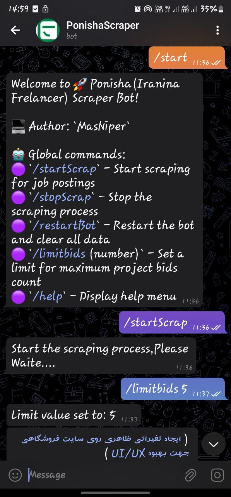

# Ponisha Scraper Bot

This project is a scraper bot designed to fetch job postings from Ponisha (an Iranian freelancer platform) and send the details to a Telegram bot.

## Sample Bot

Here is a sample of how the bot operates:




The images above show job postings being sent to the Telegram bot.

## Project Structure

- **main.py**: Contains the main logic for scraping job postings and sending them to Telegram.
- **config.py**: Contains configuration variables.

## Installation

1. Clone the repository:
    ```bash
    git clone <repository_url>
    ```

2. Navigate to the project directory:
    ```bash
    cd <project_directory>
    ```

3. Create a virtual environment:
    ```bash
    python -m venv venv
    ```

4. Activate the virtual environment:

    On Windows:
    ```bash
    venv\Scripts\activate
    ```

    On macOS/Linux:
    ```bash
    source venv/bin/activate
    ```

5. Install the required dependencies:
    ```bash
    pip install -r requirements.txt
    ```

## Configuration

Update the `config.py` file with your desired skills, base URL, Telegram API key, and chat ID.

```python
desired_skill = [
    'وردپرس',
    'پایتون',
    'react',
    'css',
    'java',
    'web-programming',
    'ios',
    'mobile-ui-design',
    'bootstrap',
    'ajax',
    'debugging',
    'ios-mobile',
    'mac-os',
    'material-design',
    'nginx',
    'node-js',
    'restful',
    'back-end',
    'front-end',
    'mobile-programming',
    'javascript',
    'react-native',
]

API_KEY = 'your-telegram-bot-api-key'
CHAT_ID = 'your-telegram-chat-id'
```

## Usage

1. Activate the virtual environment if not already activated:

    On Windows:
    ```bash
    venv\Scripts\activate
    ```

    On macOS/Linux:
    ```bash
    source venv/bin/activate
    ```

2. Run the main script:
    ```bash
    python main.py
    ```

3. The bot will start fetching job postings and send them to the specified Telegram chat.

## Telegram Commands

- `/startScrap` - Start scraping for job postings.
- `/stopScrap` - Stop the scraping process.
- `/restartBot` - Restart the bot and clear all data.
- `/limitbids (number)` - Set a limit for the maximum project bids count.
- `/help` - Display the help menu.

## Functions

- **time_now**: Get the current hour for Tehran timezone.
- **capture**: Fetch HTML pages for each desired skill from Ponisha.
- **finder**: Extract job offer details (title, description, link, price) from HTML pages.
- **sail**: Send job details to the Telegram bot.
- **loading_indicator**: Show a loading indicator for the sleep period.
- **send_welcome**: Send a welcome message when the bot starts.
- **send_help**: Send help information.
- **start_scrap**: Start the scraping process.
- **stop_scrap**: Stop the scraping process.
- **restart_bot**: Restart the bot.
- **limit_bids**: Set a limit for project bids count.

## License

This project is licensed under the MIT License. See the LICENSE file for more details.
